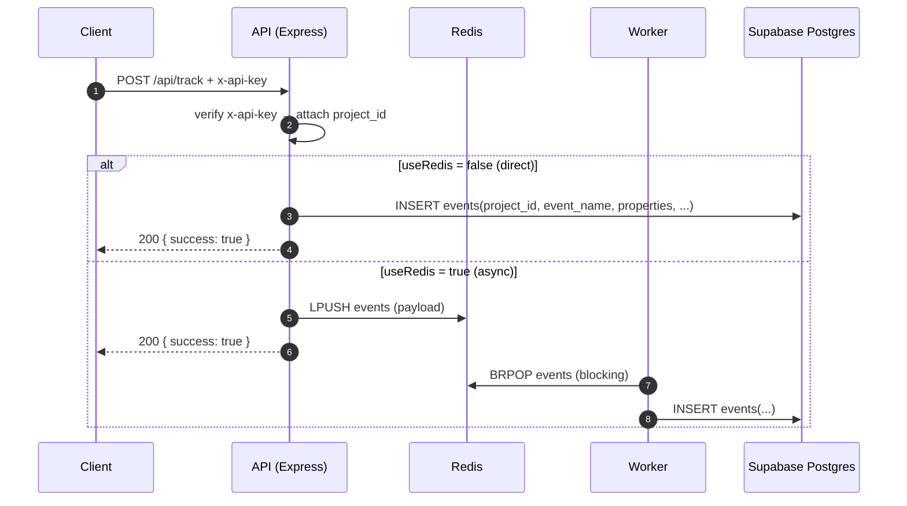
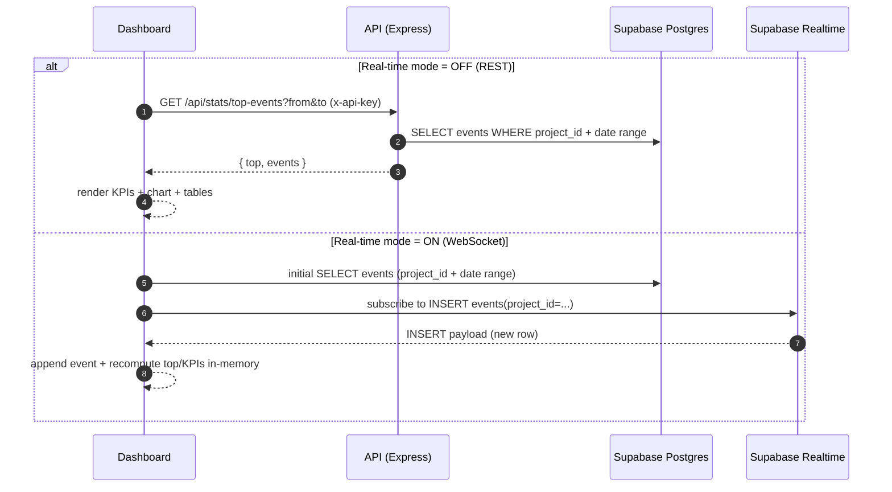
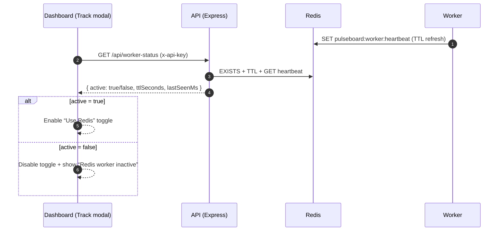

# Pulseboard — Full‑Stack Product Analytics (OSS)

Pulseboard is a lightweight analytics platform you can self-host to **track custom product events**, **process them asynchronously (Redis + worker)**, and **explore insights in a modern dashboard** with an optional **real‑time mode** (Supabase Realtime WebSocket stream).

- **Live demo**: `https://pulseboard-platform.vercel.app/`
- **GitHub repo**: `https://github.com/lalitbing/pulseboard-analytics`
- **License**: MIT (`LICENSE`)

---

## What you can do with Pulseboard

- **Track events** via `POST /api/track` (direct DB insert) or **queue to Redis** for async ingestion
- **Explore analytics** in the dashboard:
  - **Overview**: KPIs, trend chart, top events, recent activity
  - **Events**: raw event exploration (filter/search)
  - **Integration**: copy/paste snippets + SDK guidance
- **Real-time mode (UI)**: when enabled, the dashboard subscribes to Supabase Realtime (WebSocket) and updates instantly on new inserts
- **Custom event tracking UI**: a floating “Track custom event” modal that can optionally route ingestion through Redis **only when the worker is active**
- **Exports**: CSV export for Events / Top events

---

## Architecture (high level)

```mermaid
flowchart LR
  %% Lanes
  subgraph Clients
    EXT[External App / SDK / Fetch]
    UI[Dashboard (Web)]
  end

  subgraph API["API (apps/api)"]
    SVC[Express + API-key middleware]
  end

  subgraph Queue["Queue (Redis)"]
    Q[(events list)]
    HB[(pulseboard:worker:heartbeat)]
  end

  subgraph Worker["Worker (apps/worker)"]
    W[BRPOP events → INSERT]
  end

  subgraph Data["Supabase"]
    DB[(Postgres: events)]
    RT[Realtime]
  end

  %% Tracking paths
  EXT -->|"POST /api/track"| SVC
  SVC -->|"useRedis=false\nINSERT"| DB
  SVC -->|"useRedis=true\nLPUSH"| Q
  W -->|"BRPOP"| Q
  W -->|"INSERT"| DB

  %% Dashboard paths
  UI -->|"GET /api/stats/*\nGET /api/project-info"| SVC
  UI -->|"GET /api/worker-status"| SVC

  %% Worker health / gating
  W -->|"SET heartbeat (TTL)"| HB
  SVC -->|"READ heartbeat (exists/ttl)"| HB

  %% Real-time
  DB -->|"changefeed"| RT
  RT -->|"WebSocket (INSERT events)"| UI
  UI -.->|"initial SELECT (real-time mode)"| DB
```

### Components

- **API (`apps/api`)**
  - Validates `x-api-key` by looking up `projects.api_key` in Supabase
  - Accepts event payloads and either inserts directly or pushes onto Redis queue
  - Serves analytics endpoints for the dashboard (`/stats/...`)
  - Exposes worker health (`/worker-status`) based on a Redis heartbeat key
- **Worker (`apps/worker`)**
  - Consumes `events` from Redis via blocking pop
  - Writes events into Supabase
  - Publishes a heartbeat key (`pulseboard:worker:heartbeat`) so the UI can safely enable/disable Redis ingestion
- **Dashboard (`apps/dashboard`)**
  - Default mode: fetches stats via REST from the API
  - **Real-time mode**: pulls initial data from Supabase and then subscribes to inserts via Supabase Realtime (WebSocket)

---

## End-to-end flow (diagrams)

### 1) Track an event (direct insert vs async queue)



### 2) Dashboard data path (REST mode vs Real‑time mode)



### 3) “Use Redis” toggle safety (worker heartbeat → UI gating)



---

## Application usage

### Local setup (3 processes)

#### 1) API

```bash
cd apps/api
npm install
npm run dev
```

Create `apps/api/.env`:

```bash
SUPABASE_URL=
SUPABASE_KEY=
REDIS_URL=
PORT=4000
```

Health check: `http://localhost:4000/api/health`

#### 2) Worker (required for Redis ingestion)

```bash
cd apps/worker
npm install
npm run dev
```

#### 3) Dashboard

```bash
cd apps/dashboard
npm install
npm run dev
```

Create `apps/dashboard/.env`:

```bash
VITE_API_URL=http://localhost:4000/api
VITE_API_KEY=your_project_key

# Optional (only for Real-time mode in the UI)
VITE_SUPABASE_URL=
VITE_SUPABASE_ANON_KEY=
```

---

## Tracking events

### Event name rules

The dashboard UI’s custom event input allows: **alphabets, numbers, underscore** (`[A-Za-z0-9_]+`).

### API: Track event

```bash
curl -X POST "http://localhost:4000/api/track" \
  -H "x-api-key: YOUR_API_KEY" \
  -H "Content-Type: application/json" \
  -d '{"event":"signup_completed","properties":{"plan":"pro"},"useRedis":false}'
```

- **Direct**: `useRedis:false` inserts immediately into Supabase.
- **Queued**: `useRedis:true` pushes into Redis and requires the worker.

---

## Dashboard UI features

### Pages

- **Overview**
  - KPI tiles (total events, unique events, avg per active day, peak day)
  - Events-over-time chart
  - Top events
  - Recent activity list
  - Export dropdown (CSV)
- **Events**
  - Browse raw events for the selected date range
- **Integration**
  - API usage snippets
  - Stats endpoints
  - SDK usage (local install) + GitHub repo link

### Real-time mode (what it means)

When **Real-time mode** is ON:

- The dashboard **does not poll REST stats**; instead it:
  - loads initial events from Supabase for the current project/date range
  - subscribes to **INSERT** events over **Supabase Realtime WebSocket**
  - updates the UI instantly on new events

When Real-time mode is OFF:

- The dashboard fetches analytics via the API (`/stats/...`) and refreshes on interactions (date range, tracking an event, etc).

### “Track custom event” modal + Redis safety

In the modal header, **Use Redis** is:

- **enabled only when the worker is active**
- **disabled with a greyed-out UI** and the subtext “Redis worker inactive” when the worker is down
- checked using `/api/worker-status` while the popup is open (polled periodically)

This prevents pushing events into Redis when nothing is consuming them.

---

## Trade-offs (and why)

| Decision | Why we did it | Trade-off |
|---|---|---|
| **Redis list queue** (`LPUSH`/`BRPOP`) | Simple and cheap async pipeline | No native retries/DLQ; at-least-once semantics depend on worker behavior |
| **Optional direct insert** | Fast path for small traffic / demos | Bypasses queue buffering and worker backpressure |
| **Supabase for DB + Realtime** | Managed Postgres + realtime stream with minimal ops | Realtime requires correct config (env + replication/RLS) |
| **Dashboard REST mode vs realtime mode** | REST is predictable; realtime feels “alive” | Two paths to maintain; realtime is sensitive to config/network |
| **Worker heartbeat gating Redis toggle** | Prevents “events stuck in queue” UX | If Redis/heartbeat fails, UI will disable Redis ingestion for safety |

---

## FAQs

### Why is “Use Redis” disabled and showing “Redis worker inactive”?

The UI disables Redis ingestion when it can’t confirm the worker heartbeat in Redis. Start the worker (`apps/worker`) and ensure it has access to the same `REDIS_URL` as the API.

### I’m getting 401/403 from the API

- **401**: missing `x-api-key`
- **403**: invalid API key (API looks up a row in Supabase `projects` table by `api_key`)

### Real-time mode says “Missing Supabase env” or “Missing project id”

- Add `VITE_SUPABASE_URL` and `VITE_SUPABASE_ANON_KEY` to `apps/dashboard/.env`
- Ensure `VITE_API_KEY` is set so the dashboard can fetch `/project-info` and determine your `project_id`

### I tracked an event but the chart didn’t update

- In **Real-time mode**: make sure Supabase Realtime is configured and your insert triggers are streaming
- In **REST mode**: the dashboard refreshes via `/stats/top-events` after tracking; confirm the API base URL and key are correct

---

## SDK usage (not published on npm)

`pulseboard-sdk` exists in `packages/sdk`, but it is **not published on npm** yet.

From this monorepo:

```bash
cd packages/sdk
npm install
npm run build
```

Then, from your app:

```bash
npm install file:../packages/sdk
```

Usage:

```ts
import { Analytics } from "pulseboard-sdk";

const analytics = new Analytics(
  "PROJECT_API_KEY",
  "https://your-api-domain/api/track"
);

analytics.track("signup_completed", {
  plan: "pro",
});
```

---

## License

MIT — see `LICENSE`.
